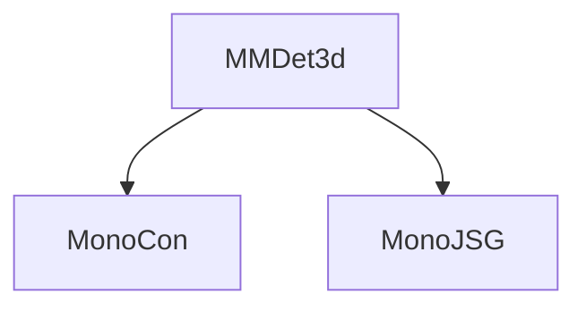
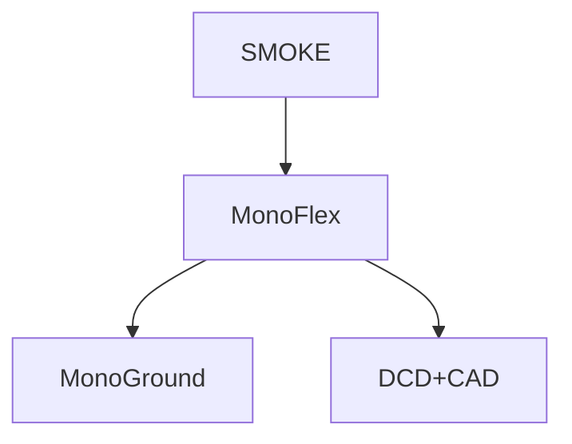
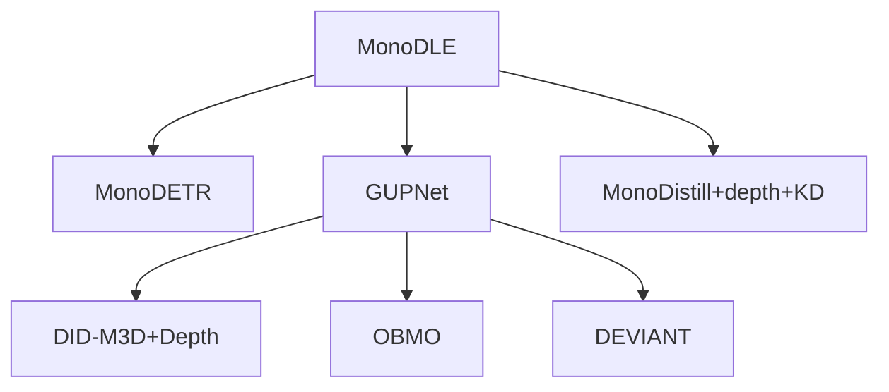
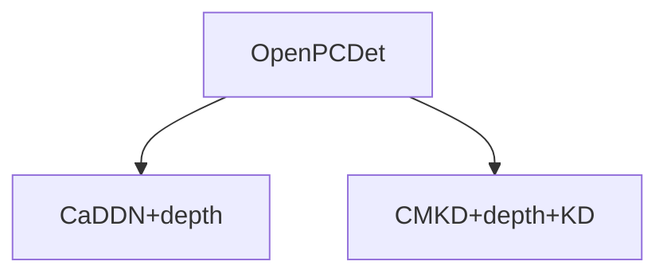

# Mono3D-Det

The following code has been available:
- **MMDet3d**

```mermaid
graph TD;
	MMDet3d-->MonoCon;
	MMDet3d-->MonoJSG;
```

- **SMOKE**

```mermaid
graph TD;
	SMOKE-->MonoFlex-->MonoGround;
	MonoFlex-->DCD+CAD;
```

- **MonoDLE**

```mermaid
graph TD;
	MonoDLE-->MonoDETR;
	MonoDLE-->GUPNet-->DID-M3D+Depth;
	MonoDLE-->MonoDistill+depth+KD;
	GUPNet-->OBMO;
	GUPNet-->DEVIANT
```

- **OpenPCDet**

```mermaid
graph TD;
	OpenPCDet-->CaDDN+depth;
	OpenPCDet-->CMKD+depth+KD;
```
